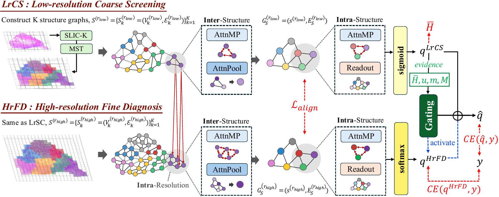

# DiagMIL

<p align="center">
  
</p>

DiagMIL is a pathologist-inspired, uncertainty-gated multi-resolution Multiple Instance Learning (MR-MIL) framework designed for efficient and precise Whole-Slide Image (WSI) diagnosis. Unlike conventional MR-MIL approaches that indiscriminately process all magnifications at a high computational cost, DiagMIL emulates the actual clinical workflow through a selective coarse-to-fine decision process: it first performs an initial screening at a low resolution using class-wise independent sigmoid evidence, and dynamically escalates to a high-resolution softmax stage via a differentiable uncertainty-aware gate only when the coarse assessment is inconclusive. Evaluated systematically on multiple clinical datasets, DiagMIL achieves state-of-the-art classification accuracy while substantially eliminating redundant fine-scale computation, offering an optimized balance between diagnostic performance and practical clinical deployability.

## Patch features (input to this code)

Experiments use pre-extracted patch features (not raw WSIs in this repository). Each slide is processed at two magnifications:

| Role | Target MPP | DiagMIL name |
|------|------------|--------------|
| Low  | 1.0 (×10)  | `x10` → `1.0.pkl` |
| High | 2.0 (×20)  | `x20` → `2.0.pkl` |

**Patching.** WSIs are read with OpenSlide and tiled via DeepZoom at the highest pyramid level. Patches are **256×256** RGB, resampled so the effective resolution matches the target MPP (tile size is scaled by `mpp / original_mpp`). Background tiles are dropped with a byte-size filter (`tile_size²`) and a tissue/colour filter (purple-stain heuristic). 

**Feature extraction.** Each kept patch is encoded with **DINO ViT-S/16** (`facebook/dino-vits16`): ImageNet-style preprocessing, **[CLS] token** as a **384-D** vector (float32).

**Per-slide `.pkl` contents.** A dict with tiling metadata (`mpp`, `rows`, `cols`, `tile_size`, `num_patches`, …) and a `features` map: keys `"row-col"`, values 384-D vectors. DiagMIL reads `features` and grid indices as patch coordinates.

**Expected layout for training:**

```
data/BRACS/{train,val,test}/Type_<class>/<slide_id>/1.0.pkl
data/BRACS/{train,val,test}/Type_<class>/<slide_id>/2.0.pkl
```

(BCNB: same structure under `data/BCNB/`.)

## Environment

```bash
conda env create -f environment.yml
conda activate diagmil
```

## Train

`main.sh` builds graphs from patch pkls (`preprocess_graph_v2.py`), then trains (`train.py`).

```bash
bash main.sh
```

Common overrides:

```bash
DATASET=BRACS GPU=0 EPOCHS=50 SEED=0 bash main.sh
SKIP_PREPROCESS=1 bash main.sh   # skip graph build; use existing graph_v2
```

Outputs: `results/<exp_name>/` (checkpoints, logs, test metrics, `summary.json`).

Graphs are written to `data/<DATASET>/graph_v2/` by default.


## Eval

Evaluate a saved checkpoint on a split (default: test):

```bash
python eval.py \
  --graph_root ./data/BRACS/graph_v2 \
  --num_classes 7 \
  --low_mag x10 \
  --high_mag x20 \
  --split test \
  --ckpt_path results/<exp_name>/checkpoints/best.pt \
  --lambda_align 0.05 \
  --lambda_H 0.1 \
  --deterministic
```

Use the same `lambda_align`, `lambda_H`, and magnifications as training. Results go to `--out_dir` (default: next to the run folder) and include `summary.json` and per-slide scores CSV.
